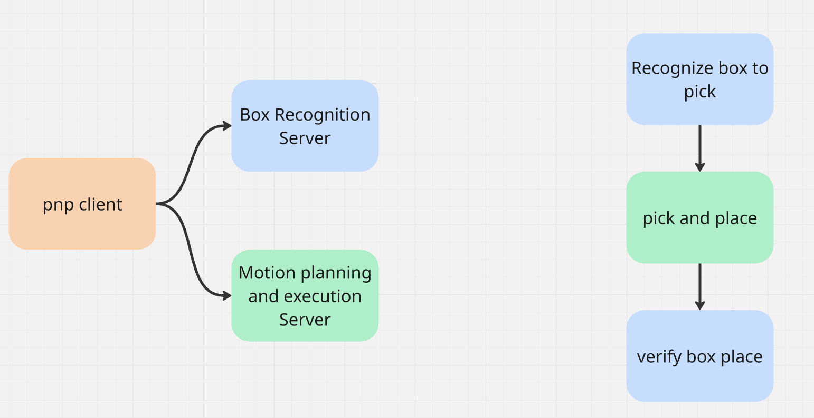

# moveit_pnp_actionlib_ws

ROS environment for ___confidential___ quant automation team technical assignment

## Dependencies

* OS: Ubuntu 20.04
* ROS noetic (see here for install instructions: <http://wiki.ros.org/noetic/Installation/Ubuntu>)
* In case you do not have ubuntu 22.04 and it is troublesome to find space on laptop for it ,trying to run project on Docker is welcomed. The project contains more or less configured docker with ROS and interactive usage, however not fully tested, might be a little buggy, feel free to correct it.

## How to setup

* Install dependencies that are defined in each package.xml (run this from the root of the workspace)

```bash
rosdep update --rosdistro=$ROS_DISTRO
rosdep install --rosdistro $ROS_DISTRO --ignore-src --from-paths src -y
```

## How to build

* You should be at the top directory of this project to build this project by catkin build
* __NOTE__: using catkin_make is acceptable, however, take into consideration we typically use catkin build at quant

```bash
catkin build -c
source devel/setup.bash
```
* In case there are some errors with cmake or googletest compatibility feel free to ignore them 
```bash
catkin build -c -DCMAKE_POLICY_VERSION_MINIMUM=3.5
```
* Verify that all dependencies have been installed correctly by running:
```bash
roslaunch moveit_pnp_server moveit_pnp_server.launch
```

## How to run

* Please fill this in with all details required to run your code

## Limitations, assumptions, and other notes

* Please fill this in as you see fit. Feel free to also remove if not required
* If you find any errors in our environment and/or descriptions, please let us know!

## Assignment notes

* ___DO NOT___ post your solutions on any public repos (private is fine, please send us an invite)
* Please create this project in your ideal presentation reflecting code style, file structure, version control (we use git at quant), etc.
* Expect interviewers to run this
* _You are strongly encouraged to complete as much as possible regardless of all packages etc. working perfectly_
* Code can be completed in __C++__ or __python__
* Please see below for a visualisation of the pick and place environment (the IDs DO NOT match the included yaml, they are visual only)
* These tasks can be done in any order, however, at some point their development will become intertwined.
* You are encouraged to ask for clarifications when needed or discuss your proposed ideas on Slack
* __NOTE__: the package.xml and CMakeLists for `moveit_pnp_server` likely contain more packages than required. It is your decision if you want to trim these down or leave them as is
* See the diagram below to understand the connection between the state machine and other modules
* External libraries are welcome provided their use is well reasoned

### MoveIt pick and place server
* Whole idea is that robot must take box from one table and put it on the other one 
* Verify that the included launch file loads MoveIt RViz with the Panda robot and tables environment
* Implement actionlib server to receive requests from the state machine
* Implement MoveIt interface to process requests (create motion plans, and execute valid motions)
* Minimum required actions requests are to either Move to pose, Pick at pose, or Place at pose
* The minimum desired input is the target pose of the robot end-effector
* The minimum desired output is the success status of the plan and execution, however, it is also beneficial to know why the server failed rather than a simple “yes or no” reply
* The action feedback is entirely at your discretion
* The desired usage is to make a call to the actionlib server with the target pose and have the server plan motion, and if it succeeds, execute the motion on the robot.
* Please use as many resources as are available to you when using the Panda robot in MoveIt. We DO NOT expect you to make your own MoveIt config or anything like that.

### State machine

* Please implement a finite state-machine to handle transitions between states including failures
  * Note that failures can simply terminate the application, however, this must be done safely and with proper logging
  * It is ___not___ required to implement the state-machine fully by hand. Please use open-source libraries to your best discretion (either ROS or otherwise)
* Create a new ROS package in the workspace and configure the xml and CMake to include any required libraries (ROS and/or external)
* Design the state transitions so that the previous state’s information is passed into next state
* For box recognition server, please still implement actionlib client/server for them. The execution call of the server will simply be a dummy method like sleeping for X seconds etc.
* With this in mind, please also take into consideration what meaningful I/O might be for this server (e.g. at least a box pose for box recognition action)
* Implement actionlib client to send requests to the moveit_pnp-server
* Test state transitions and completion of MoveIt server requests

### General flow(simple scenario)

* Client gets box pose from box recognition action server
* Box pose is passed to pnp action server
* Box recognition action server verifies box placement



* Ideally it is preferred 